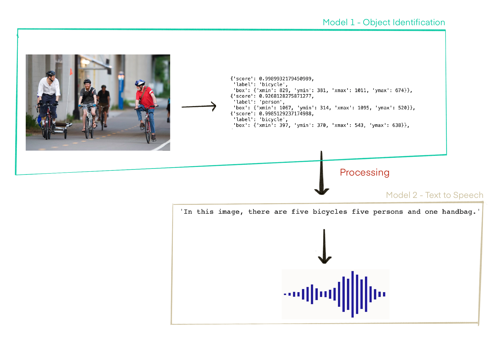

# A Object Identification and text to speech model using HuggingFace Transformers

Learn how to build the below pipeline using Gradio (for user interface and deployment), Facebook' detr-resnet-50 model for Object Identification and kakao-enterprise' vits-ljs model for text to speech. 




## Description

The Image Description and Audio Transcript App is a web-based application that leverages artificial intelligence to generate descriptions for uploaded images. Additionally, the tool provides an audio transcript of the description for users with visual impairments, making it more accessible.

This app uses BLIP (Bootstrapping Language-Image Pre-training) for image captioning and gTTS (Google Text-to-Speech) for converting the description into an audio file.

## Features

* Upload an image and receive an AI-generated description.
* Convert the description into an audio file for accessibility.
* Responsive web interface built using Gradio.
* Simple, user-friendly design for a seamless experience.

## Technologies Used

* Programming Language: Python 3.7+
* AI Model: BLIP for image captioning
* Text-to-Speech: gTTS (Google Text-to-Speech)
* Web Interface: Gradio
* Libraries: PyTorch, Transformers, Gradio, gTTS

## Libraries and Dependencies

* torch: Deep learning framework for the BLIP model
* transformers: Hugging Face library for pre-trained models like BLIP
* gtts: Library for text-to-speech conversion
* gradio: For building the web interface

## To install the necessary packages, run:

```bash
pip install torch transformers gtts gradio
```

## Installation and Setup

* Clone the repository:
```bash
git clone https://github.com/your-username/image-description-audio-transcript.git
cd image-description-audio-transcript
```

* Create a virtual environment (optional but recommended):
```bash
python -m venv venv
source venv/bin/activate  # On Windows, use venv\Scripts\activate
```

* Install the required packages:
```bash
pip install torch transformers gtts gradio
```

* Ensure that the necessary models are downloaded: The BLIP model will automatically be downloaded when the script is run, and gTTS will use an online service to convert text to speech.

## Usage

1. Run the application:
```bash
python object_detection.py
```
2. Open a web browser and navigate to http://127.0.0.1:7860 to access the app.
3. Upload an image through the provided input.
4. Click the `Generate Description` button to get a text description of the image.
5. Click the `Click here for an audio transcript` button to hear the description.

## Configuration

You can modify the following parameters in the app.py file:

* host: The IP address on which the server runs (default: '127.0.0.1')
* port: The port number (default: 7860)
* debug: Debug mode for development (default: True)

## Contributing

Contributions to improve the Image Description and Audio Transcript App are welcome. Please follow these steps:

* Fork the repository.
* Create a new branch (git checkout -b feature/AmazingFeature).
* Commit your changes (git commit -m 'Add some AmazingFeature').
* Push to the branch (git push origin feature/AmazingFeature).
* Open a Pull Request.

## License

This project is licensed under the MIT License - see the LICENSE.md file for details.

## Acknowledgments

* Salesforce for the BLIP image captioning model.
* Google for the gTTS service.
* Gradio for the easy-to-use interface framework.

## Disclaimer

This tool is designed to assist with generating descriptions and audio transcripts from images, but always review the generated content for accuracy and appropriateness before use.
